# yamori4webAuthn
Web Authentication Sample Application For PHP.

※英語のReadMeページは[こちら](https://github.com/yamori4/yamori4webAuthn/blob/master/README.md) 


1. [概要](#概要)
2. [デモサイト](#デモサイト)
3. [画面キャプチャー](#画面キャプチャー)
4. [動作環境構築手順](#動作環境構築手順)
5. [使い方](#使い方)
6. [使用させて頂いたオープンソース](#使用させて頂いたオープンソース)
7. [ライセンス](#ライセンス)
8. [注意事項](#注意事項)
9. [作者](#作者)


## 概要

FIDO2を構成する要素であるWebAuthn（[Web Authentication](https://www.w3.org/TR/webauthn/)）のサンプルアプリです。中小企業でそれなりに多く利用されているであろうLAMP環境での需要に応えようとPHPで開発しました。

昨今、コロナ禍の影響もありリモートワークにおける認証機能の需要も上がってきてますので、その導入の手助けになればと思います。


## デモサイト
[https://endlesshard.work/yamori4webAuthn/index.html](https://endlesshard.work/yamori4webAuthn/index.html)

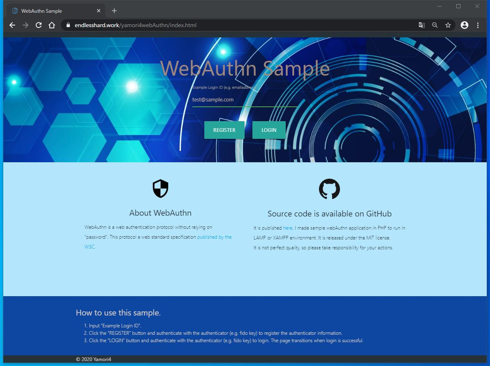 


## 画面キャプチャー

 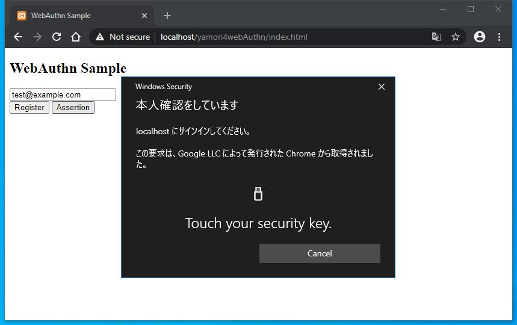

 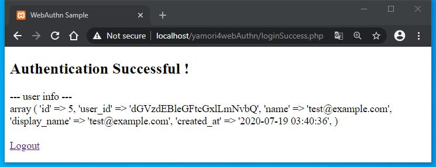


## 動作環境構築手順

* **動作に必要な環境/機器**

	* PHP動作環境
	
	  <small>※一部のメソッドがPHP7.4以上でないと動作しないため、それ以上のバージョンの利用を推奨します。</small>
	
	* MySQL動作環境
	
	* 一般的なWEBブラウザ（Chrome, Firefox, Edge,など、IEはWebAuthn非対応）
	
	* FIDOの認証器、または、Windows Helloなど
	
	

* **ミドルウェアの構築**

  [こちら](https://github.com/yamori4/objectOriented/blob/master/_readMe/installXampp.md)にXAMPPの構築手順をまとめていますので参考にしてください。

  また、本ドキュメントではXAMPP環境を前提としたものではありますが、当然LAMP環境でも動作します。

  

* <b>ソースコードのダウンロードと配置</b>

  <small>※XAMPPのインストールが完了しており、「C:\xampp」にインストールされている前提です。</small>

1. [GitHubのページ](https://github.com/yamori4/yamori4webAuthn)から当アプリケーションのソースコードをダウンロードします。ここではzipファイルのダウンロードをしてみましょう。GitHubページの「Clone or download」から「Download ZIP」をクリックします。 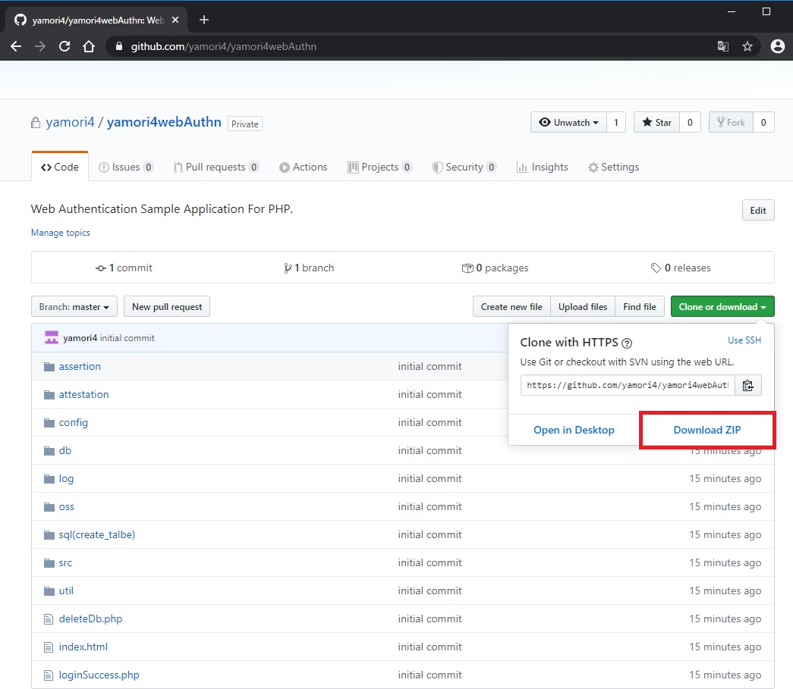

     

2. ダウンロードしたzipファイルを解凍します。

     

3. 解凍したファイルは名前が「yamori4webAuthn-master」となっているので「yamori4webAuthn」に変更しておきましょう。

     
  
4. 「C:\xampp\htdocs」配下に解凍したファイルを配置します。以下のようなディレクトリ構成になっていればOKです。

 ```
 C:
 └xampp
   └httocs
     └yamori4webAuthn
       ├─assertion
       ├─attestation
       ├─config
       ├─db
       ├─log
       ├─oss
       ├─sql(create_table)
       ├─src
       ├─util
       ├─deleteDb.php
       ├─index.html
       └─loginSuccess.php
 ```

5. 構築自体は以上で完了なのですが、実際にウェブサービスとして稼働させて軽く動作確認をしてみましょう。「C:\xampp\xampp-control.exe」という実行ファイルをクリックしてXAMPPのControl Panelを起動します。

   

6. Apacheを起動します。Apacheの「Start」ボタンをクリックしてください。

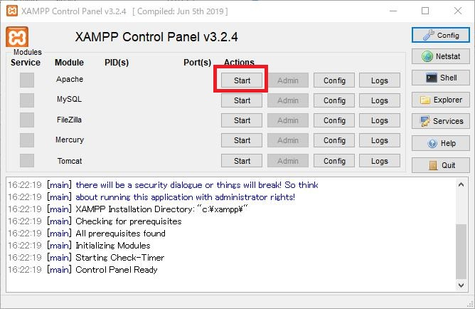


7. 起動できました。

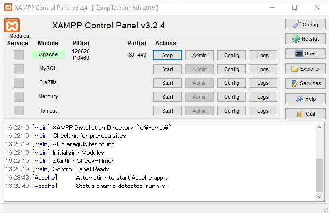


8. 任意のウェブブラウザを起動してください、ここではChromeを使用しています。アドレスバーに「 https://localhost/yamori4webAuthn/index.html 」と入力してみてください。以下の画面が表示されます。XAMPPできちんとした設定をすればエラーは出なくなりますが、今回は接続先が自分のPC(localhost)であることをしっかりと確認したうえで接続します。Chromeの場合だと「詳細設定」ボタンをクリックしてから、「localhostにアクセスする」をクリックしてください。
（ちなみに、WebAuthnは"http"だと使用できません、"https"である必要があります。）

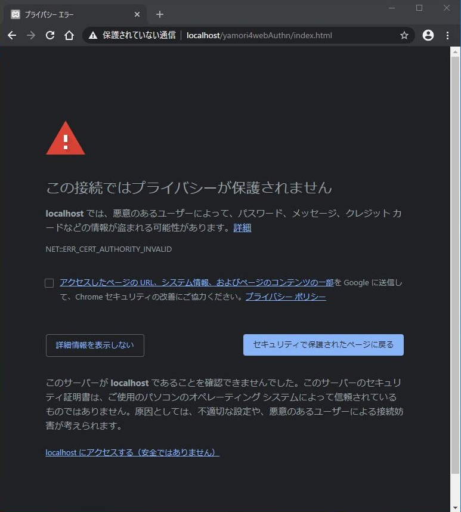 


9. 以下の画面が表示されます。（※データベースの設定等をやっていないのでまだ動きません。）

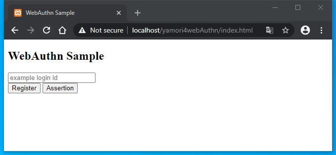


* **データベースへのテーブル作成**

  ※XAMPPのインストールが済んでいる前提です。

1. XAMPPのコントロールパネルを起動します。

   

2. ApacheとMySQLの[Start]ボタンをクリックして、ApacheとMySqlを立ち上げます。

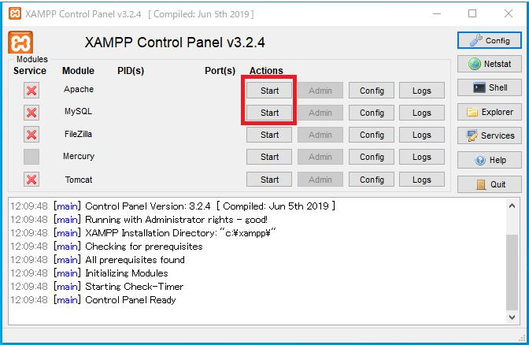

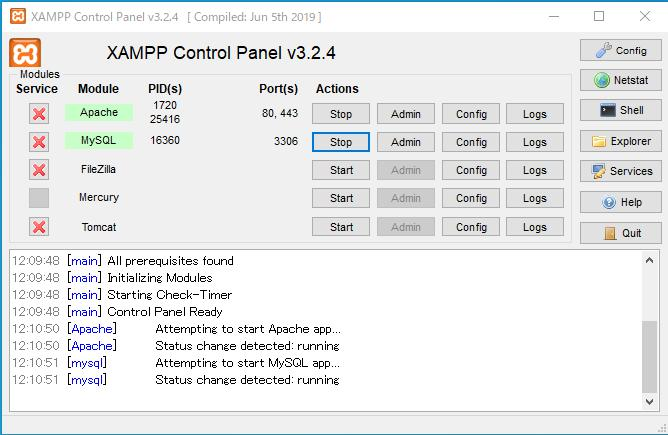


3. MySqlの[Admin]ボタンをクリックすると、WEBブラウザでphpMyAdminのコンソールが開かれます。MySqlのアカウントとパスワードを設定していれば、それの入力を求めれられるので入力してログインして下さい。

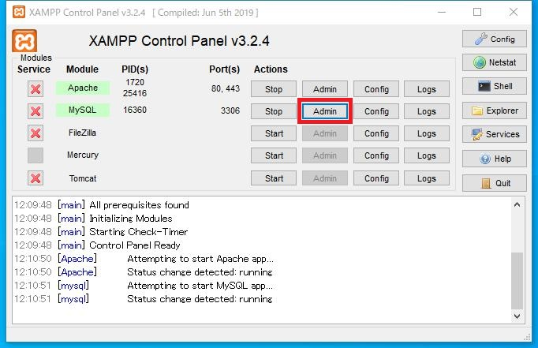


4. 新規にデータベースを作成します。ここではデータベースの名前を「test」とします。

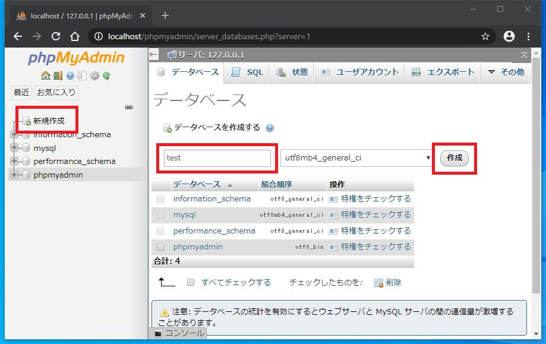


5. データベース「test」にテーブルを作成します。「yamori4webAuthn/sql(create_table) 」配下にあるテキストファイルに記載されているSQLを、[SQL]タブのクエリ入力欄に入力して[実行]ボタンをクリックします。本アプリでは「user」テーブルと「web_authn」テーブルを作成する必要があります。

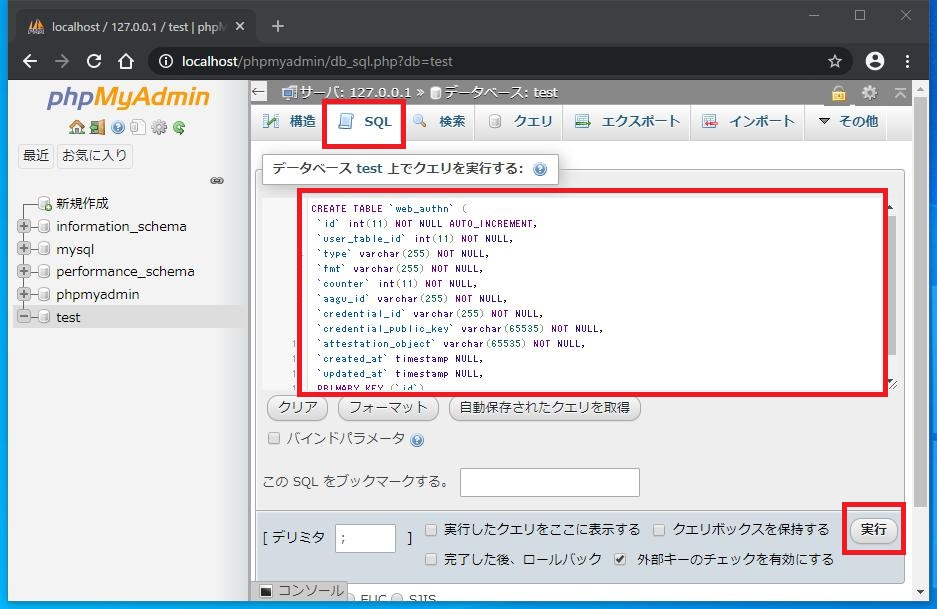

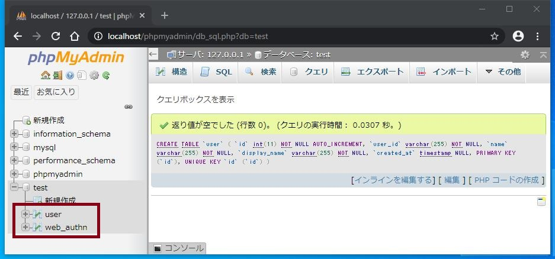


* **アプリケーションの設定**

  * yamori4webAuthn/config/config.ini ファイルをテキストエディタで開き、必要に応じて各パラメータを変更します。

    * **test_mode** → true / false でテストモードのON/OFFを切り替える。テストモードだとデバッグ用のログがいっぱい出力されたり、 https://localhost/yamori4webAuthn/deleteDb.php にアクセスするとデータベースに登録されているユーザ情報とWebAuthnの鍵情報を削除できたりと、テスト用に若干挙動を変えている。
    * **relying_party**  → WebAuthnを使用するサイトのドメイン名、ローカル環境ならば「localhost」で問題ない。実はwebAuthn認証利用時のパラメータに用いられる値。
    * **db_data_source_name** → データベースのデータソース名。
    * **db_user_name** → データベースへのログインユーザ名。
    * **db_password** →  データベースへのパスワード。
    

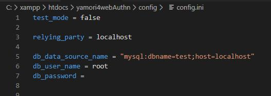


## 使い方

1. 設定直後の場合、念のためApacheとMySqlを再起動しておきます。

   

2. 一般的なWEBブラウザ(Chrome, Firefox, Edge,など)を用い、構築したウェブページ「 https://localhost/yamori4webAuthn/index.html 」を開きます。

   

3. まず認証器を登録します。適当なログインIDを入力し、”Register”ボタンをクリックします。

   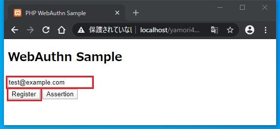

   <small>※ちなみに認証器は以下の画像のようにUSBに接続して使うタイプのものや、Windows Helloが相当します。またAndroidのバージョン 7.0（Nougat）以上だと元々ハードウェアに認証器が内蔵されてますので、スマートフォンで指紋認証とか顔認証が対応していれば、それと連動してFIDO2認証が使えるので生体認証が捗ります。また下記画像のUSBタイプのもののうち、いくつかはNFC機能に対応しているのでそれをスマートフォンで読み込ませたり、USB Type-Cで接続可能な認証器だと直接スマートフォンに接続して認証することもできます。（※iOS端末は現状(2020年5月時点)では状況がちょっと複雑みたいなので、お手数ですが各自で対応状況をご確認ください。）</small>

   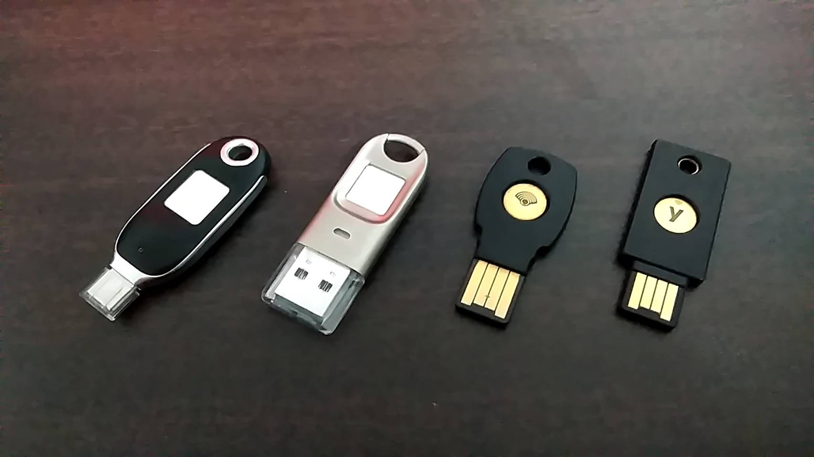

   

4. WEBブラウザから本人確認のためのリクエストが要求されるので、認証器を用いて認証を実施してください。

   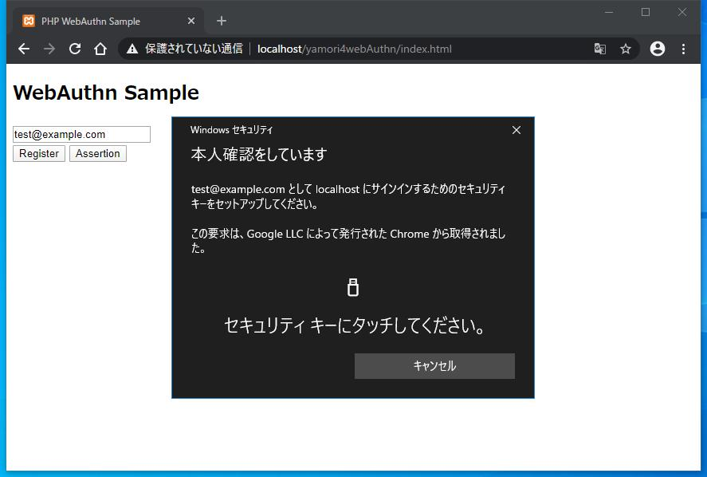

   

5. 認証に成功します。

   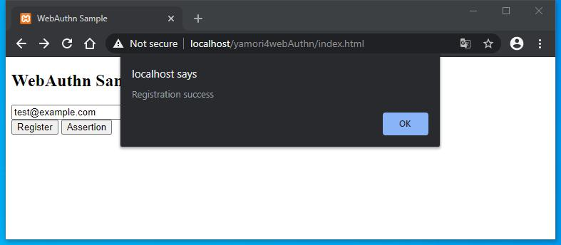

   

6. 続いてログイン処理に相当する認証を実施します。先ほど設定したログインIDを入力して、”Assertion”ボタンをクリックします。

   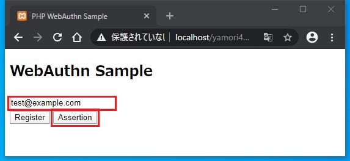

   

7. WEBブラウザから本人確認のためのリクエストが要求されるので、認証器を用いて認証を実施してください。

   

   

8. 認証に成功し、ログイン後の画面に遷移します。

   

   

   ※ここで"Logout"をクリックするとセッション情報を削除してログアウトし、認証画面に戻ります。

   ※ちなみにログイン認証していない状態で、ログイン後の画面を表示した場合は以下のようになります。

   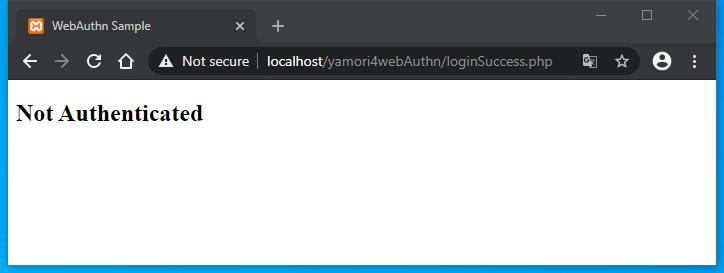


#### その他の機能について

* **ログ出力**

  yamori4webAuthn/config/ 配下にログファイルが出力されます。ログの出力先は yamori4webAuthn/util/log.php 内で定義していますので、そちらで変更可能です。

  

* **データベースに記録されているデータの削除**

  <small>※yamori4webAuthn/config/config.ini ファイルで、「test_mode = true」にしている場合のみ使用可能です。</small>

  WEBブラウザのアドレスバーに「 https://localhost/yamori4webAuthn/deleteDb.php 」と入力すると、データベースに記録されているユーザ情報とWebAuthnの鍵情報を削除できます。テスト時には便利ですが、<u>もし商用利用される場合はこの機能を削除したほうが良いと思います。</u>

  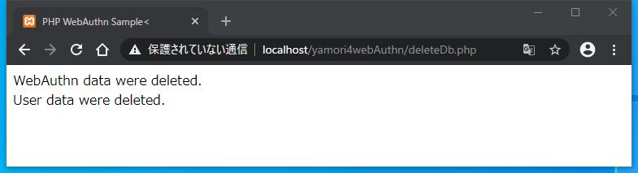


## 使用させて頂いたオープンソース

* [WebAuthnDemo](https://github.com/google/webauthndemo/blob/master/src/main/webapp/js/webauthn.js)
  *&copy; 2017 Google Inc. All Rights Reserved.*
  *Released under the Apache License, Version 2.0*
  *see http://www.apache.org/licenses/*


* [CBOR encoder for PHP](https://github.com/2tvenom/CBOREncode)
  *&copy; 1999 - 2012 The PHP Group. All rights reserved.*
  *Released under the PHP License, version 3.01*
  *see https://www.php.net/license/index.php*
  *This product includes PHP, freely available from https://www.php.net/*

#### 謝辞

本アプリを開発するにあたって上記のオープンソースを使用させていただきました。こられのプログラムの開発者様に心より感謝申し上げます。


## ライセンス

"yamori4webAuthn" is under [MIT license](https://opensource.org/licenses/mit-license.php).
© 2020 Yamori4. All rights reserved.


## 注意事項

- [使用させて頂いたオープンソース](#使用させて頂いたオープンソース)は [MIT license](https://opensource.org/licenses/mit-license.php)ではないので、そちらについてもご考慮ください。一応、オープンソースを利用したものは yamori4webAuthn/oss 配下にまとめてあるので、そちらを別モジュールに置き換えていただくという方法もあります。
- MITライセンス内にも記載されていますが、本アプリケーションの利用に起因もしくは関連して発生した損害に対して、作者は一切の責任を負いかねます。
- 本サンプルアプリはWebAuthnの機能を完全に実装しているわけじゃないです。特に The FIDO Alliance Metadata Service (MDS) に関しては全くの未実装だし、Trusted Platform Module (TPM)についてもまだまだ理解が浅いです。ある程度使える品質だと自分では思っていますが、未実装の箇所や納得していない実装箇所が幾つか残っていて、テストも十分にはやってないです。
- ソースコード内で .htaccess ファイルを使用していますが、これは一般的には非推奨です。今回はサンプルアプリということで、少々面倒なApache側の設定をせずに環境構築したいという意図があったため .htaccess を使用しました。
- 反社会的勢力、および、その関係者のご利用はご遠慮いただきます。

- 商用利用する場合、[作者にまでご一報](<mailto: yamori4.113@gmail.com>)いただければ幸いです。どういった使われ方をするのかくらいは知っておきたいので。


## 作者

​	**[yamori4](<mailto: yamori4.113@gmail.com>)**

​	<small>WEB系の仕事をメインでやってたシステムエンジニア。セキュリティ・認証周りがほどほどに出来るおっさん。最近はWEB以外もぼちぼちやってる。</small>


以上